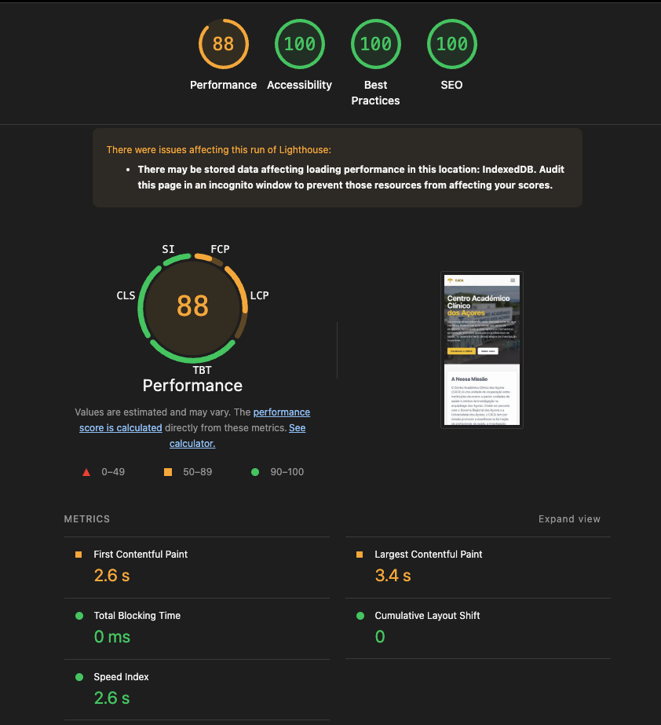

# Projeto TE1 - Fase 3 (PI3) - Landing page do Centro Académico Clínico dos Açores (CACA)

Este repositório contém o código-fonte e a documentação referente à **terceira e última fase (PI3)** do projeto da unidade curricular de Tecnologias Web.

A documentação da primeira e segunda fase (PI1 e PI2) pode ser consultada no repositório anterior: [Verotic/Projeto-PEI2](https://github.com/Verotic/Projeto-PEI2).

## a) Identificação do grupo (PI3)

- Adriano Furtado Arruda - 2024111815
- Júlia Melo Freitas - 2024114388
- Daniela de Lima Gabriel- 30230007

## b) Descrição do Projeto (Fase 3)

O objetivo principal desta fase é a **persistência de dados e integração de APIs externas** na landing page do CACA, utilizando tecnologias como IndexedDB e consumo de serviços web de terceiros, mantendo a arquitetura modular e boas práticas de UI/UX. 
*(Nota: As tarefas abaixo descritas encontram-se planeadas e distribuídas, estando o projeto no início da sua implementação.)*

### Funcionalidades a Implementar e Distribuição de Tarefas

Nesta fase, as tarefas foram distribuídas de acordo com os planos de trabalho de cada elemento da equipa:

#### 1. Eventos e API de Mapas (Adriano)
Responsável pela base da plataforma: Gestão de Eventos e a sua localização no mapa.
-   **CRUD de Eventos:** Criação de formulários e lógica para adicionar, visualizar, editar e remover eventos (título, descrição, data, hora, local) utilizando a IndexedDB para persistência de dados.
-   **API de Mapas:** Integração de uma API (como Leaflet/OpenStreetMap ou Google Maps) para mostrar um mapa interativo com a localização do evento criado.
-   **Módulos:** `js/modules/EventManager.js` e `js/services/MapService.js`.

#### 2. Newsletter, UI/UX e API Meteorológica (Daniela)
Foco na Interação com o Utilizador, captura de contactos e previsão do tempo para os eventos criados.
-   **Newsletter com Persistência:** Criação do formulário de subscrição, validação robusta e gravação local na IndexedDB, com feedback visual.
-   **API Meteorológica:** Consumo de uma API (ex: OpenWeatherMap) para devolver condições climáticas esperadas para os eventos.
-   **UI/UX e Acessibilidade:** Garantir que novos formulários e listagens seguem o design original, são responsivos e acessíveis (navegação por teclado).
-   **Módulos:** `js/modules/NewsletterManager.js` e `js/services/WeatherService.js`.

#### 3. Core DB, API de Notícias e Integração (Julia)
Responsabilidade da Arquitetura da Base de Dados, consumo de Notícias e Documentação.
-   **Core IndexedDB:** Criação da classe principal para ligação à base de dados e criação das Object Stores (tabelas) para Eventos e Newsletter.
-   **API de Notícias/RSS:** Consumo de um feed de notícias de saúde/CACA através de API ou RSS público e apresentação dinâmica.
-   **Integração e Documentação:** Inicialização de todas as classes no `main.js` e redação deste `README.md`.
-   **Módulos:** `js/core/Database.js`, `js/services/NewsService.js` e `main.js`.

## c) Estrutura do Projeto e Tecnologias

A arquitetura continua focada na **decomposição funcional**, **modularização** e **Programação Orientada a Objetos (POO)**:

### Estrutura de Pastas Esperada:
```
/
├── assets/             # Imagens e recursos estáticos
├── styles/             # Módulos CSS separados por componente/área
├── js/                 # Código JavaScript
│   ├── core/           # Lógica central da aplicação
│   │   └── Database.js # Gestão global e conexão da IndexedDB
│   ├── modules/        # Módulos independentes (Classes)
│   │   ├── EventManager.js
│   │   └── NewsletterManager.js
│   ├── services/       # Serviços e consumo de APIs externas
│   │   ├── MapService.js
│   │   ├── WeatherService.js
│   │   └── NewsService.js
│   └── main.js         # Ponto de entrada e integração da aplicação
├── index.html          # Estrutura HTML
├── style.css           # Entry-point CSS
└── README.md           # Documentação
```

## d) Identidade Visual e Design

O nosso protótipo base (mockup) foi desenvolvido no Figma:
[Figma do Projeto TE1](https://www.figma.com/design/SNOlEnaHQc2sBNPphX713Q/TE1?node-id=0-1&t=g3v6JbHW5wJggUtT-1)

---

## Benchmarking (Fase 3)

### Resultados do Benchmark



---

# TE1 Project - Phase 3 (PI3) - Azores Academic Clinical Center (CACA) Landing Page

This repository contains the source code and documentation for the **third and last phase (PI3)** of the Web Technologies course project.

Documentation for the first and second phases (PI1 and PI2) can be found in the previous repository: [Verotic/Projeto-PEI2](https://github.com/Verotic/Projeto-PEI2).

## a) Group Identification (PI3)

- Adriano Furtado Arruda - 2024111815
- Júlia Melo Freitas - 2024114388
- Daniela de Lima Gabriel - 30230007

## b) Project Description (Phase 3)

The main goal of this phase is **data persistence and external API integration** into the CACA landing page, using technologies like IndexedDB and consuming third-party web services, while maintaining the modular architecture and UI/UX best practices.

### Planned Features and Task Distribution

#### 1. Events and Maps API (Adriano)
-   **Events CRUD:** Forms and logic to add, view, edit, and remove events using IndexedDB.
-   **Maps API:** Integration of an API (Leaflet/OpenStreetMap or Google Maps) to display interactive maps for events.
-   **Modules:** `js/modules/EventManager.js` and `js/services/MapService.js`.

#### 2. Newsletter, UI/UX, and Weather API (Daniela)
-   **Persistent Newsletter:** Subscription form with robust validation and local IndexedDB storage.
-   **Weather API:** Integration of a weather API (e.g., OpenWeatherMap) to show expected conditions for events.
-   **UI/UX and Accessibility:** Ensuring responsiveness and keyboard accessibility for new elements.
-   **Modules:** `js/modules/NewsletterManager.js` and `js/services/WeatherService.js`.

#### 3. Core DB, News API, and Integration (Julia)
-   **Core IndexedDB:** Main class to connect and create Object Stores for Events and Newsletter.
-   **News/RSS API:** Consuming a public health/CACA news feed and displaying it dynamically.
-   **Integration and Documentation:** Initializing all classes in `main.js` and maintaining `README.md`.
-   **Modules:** `js/core/Database.js`, `js/services/NewsService.js`, and `main.js`.

## c) Project Structure and Technologies

### Expected Folder Structure:
```
/
├── assets/             # Images and static resources
├── styles/             # CSS Modules
├── js/                 # JavaScript Code
│   ├── core/           # Core application logic (Database.js)
│   ├── modules/        # Independent Modules (EventManager.js, NewsletterManager.js)
│   ├── services/       # External APIs (MapService.js, WeatherService.js, NewsService.js)
│   └── main.js         # Application Entry Point
├── index.html          # HTML Structure
├── style.css           # CSS Entry-point
└── README.md           # Documentation
```

## d) Visual Identity and Design

[TE1 Project Figma](https://www.figma.com/design/SNOlEnaHQc2sBNPphX713Q/TE1?node-id=0-1&t=g3v6JbHW5wJggUtT-1)

---

## Benchmarking

### Benchmark Results


